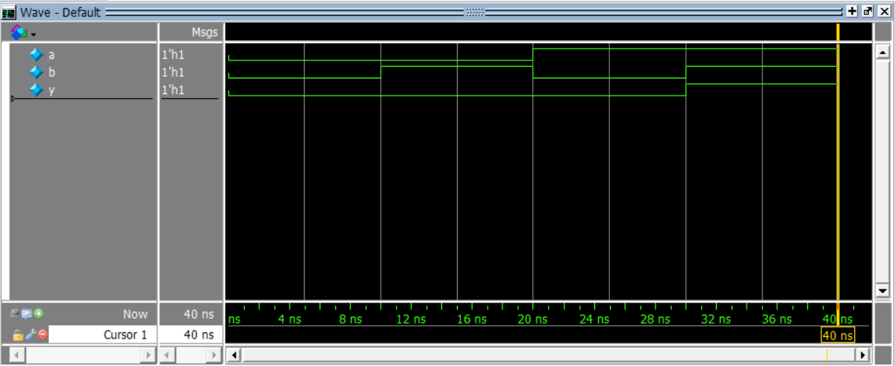
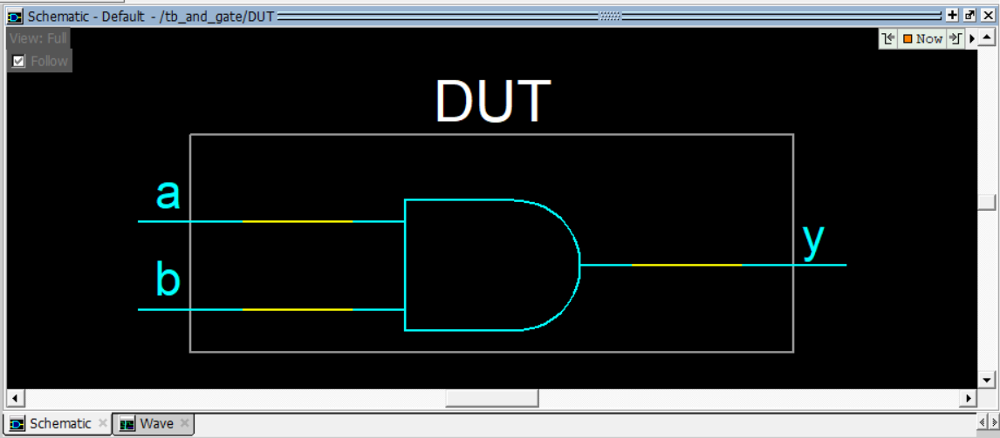
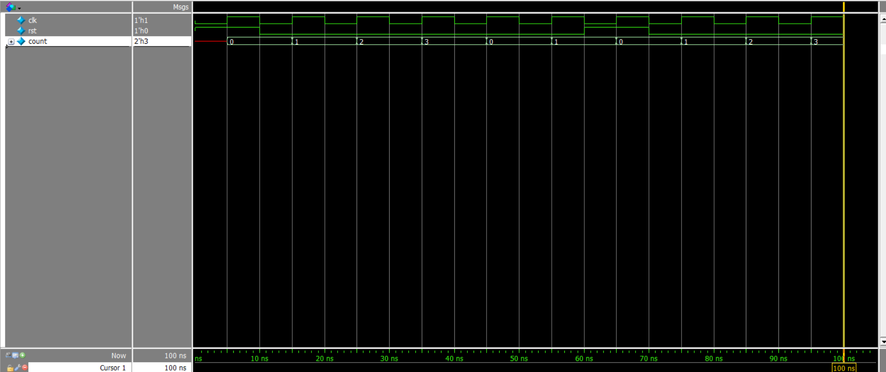
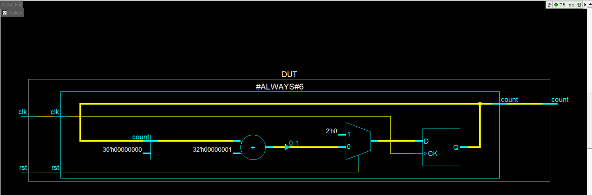

# Day 1 : Digital Logic and RTL Thinking

Day 1 emphasizes the basic difference between software coding and hardware and the thnking process behind RTL Design and Verification.

Software runs instructions sequentially in time - one after the other whereas Hardware executes everything in parallel.

## RTL FLow from Idea to Code 

1. Understand the requirement - What is the Function?
2. Draw the block diagram - what logic blocks and registers are needed ? 
3. Deciding clocking - How many clocks ? Synchronous or Asynchronous reset ?
4. Write the RTL code - Use synthesizable verilog constructs
5. Verify - Test with a simulation before synthesis

Two sample codes are written to understand the process of verilog coding - design and testbench for simulation

<details><summary><b>Sample Code 1 : AND gate</b></summary>

### Design 

```verilog
module and_gate(
    input a, b,
    output y
);

assign y = a & b;

endmodule
```

### Testbench

```verilog
`include "../rtl/sample_adder.v"
module tb_and_gate();

    reg a, b;
    wire y;

    and_gate DUT (
        .a(a),
        .b(b),
        .y(y)
    );

    initial begin
        $display("A B | Y");
        a = 0; b = 0;
        #10
        $display("%b %b | %b", a, b, y);
        a = 0; b = 1;
        #10
        $display("%b %b | %b", a, b, y);
        a = 1; b = 0;
        #10
        $display("%b %b | %b", a, b, y); 
        a = 1; b = 1;
        #10
        $display("%b %b | %b", a, b, y);
        $finish;
    end
endmodule
```

### Simulation



### Schematic 



</details>

---

<details><summary><b>Sample Code 2 : Counter</b></summary>

### Design 

```verilog
module counter_2_bit(
    input clk, rst,
    output reg [1:0] count
);

    always@(posedge clk)begin
        if(rst)
            count <= 2'b00;
        else
            count <= count + 1; 
    end

endmodule
```

### Testbench

```verilog
`include "../rtl/sample_counter.v"

module tb_counter_2_bit;

    reg clk, rst;
    wire [1:0] count;

    //DUT instance
    counter_2_bit DUT(
        .clk(clk),
        .rst(rst),
        .count(count)
    );

    //clock generation
    initial clk = 0;
    always #5 clk = ~clk; //10 ns clk period -> 100 MHz

    initial begin
        $display("Time\tRST\tCount");
        $display("-------------------");

        //apply reset for 1 cycle
        rst = 1'b1;
        #10;
        rst = 1'b0; //remove rst
        #50 //Run counter for few cycles
        rst = 1; //apply reset again
        #10;
        rst = 0;
        #30
        $finish;
    end

    //monitoring any changes in the signals and displaying them in console 
    initial begin
        $monitor("%0t\t%b\t%b", $time, rst, count);
    end
    
endmodule
```

### Simulation



### Schematic 



</details>

---